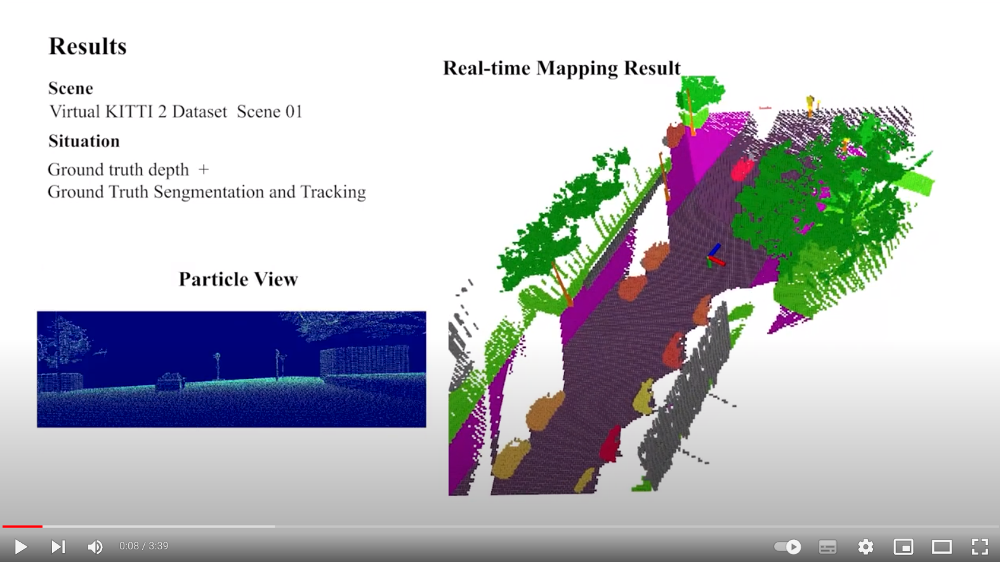
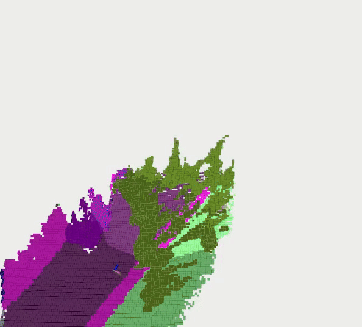

# Semantic DSP Map
__Particle-based Instance-aware Semantic Occupancy Mapping in Dynamic Environments__

[Gang Chen](https://g-ch.github.io/), Zhaoying Wang, [Wei Dong](https://scholar.google.com/citations?user=hbaEVRMAAAAJ&hl=en), [Javier Alonso-Mora](https://autonomousrobots.nl/people/)

[[PDF]](https://www.arxiv.org/abs/2409.11975)
 <!-- [[Youtube]](https://youtu.be/OIJDZRtHFHE) -->

[](https://youtu.be/OIJDZRtHFHE)


## Description
This repository contains the code for paper "Particle-based Instance-aware Semantic Occupancy Mapping in Dynamic Environments". This paper is still under review. 
This map is an instance-aware ego-centric semantic occupancy map for dynamic environments with objects like vehicles and pedestrians. Static environment is also suitable.

The C++ source file for mapping is in the ```include/``` folder and a ROS1 node example that uses the map is given in ```src/mapping.cpp```

The following gifs shows a mapping result using the Virtual Kitti 2 dataset (left) and using a ZED2 camera in the real world.

<p align="center">


</p>


## Quick Installation
Tested Environment: Ubuntu 20.04 + ROS Noetic

- Our code uses yaml-cpp. Follow instructions in [yaml-cpp](https://github.com/jbeder/yaml-cpp) to install it.

- Then download and compile the mapping code by

```
mkdir -p semantic_map_ws/src
cd semantic_map_ws/src
git clone git@github.com:g-ch/mask_kpts_msgs.git
git clone --recursive git@github.com:tud-amr/semantic_dsp_map.git
cd ..
catkin build
```

## Quick Test Guidance

### Test with Real-world Data Captured by ZED2 Camera
Download a ros data [bag](https://drive.google.com/file/d/1uBWbLzmePzmY5ZFXP_wEjuAlcOgEeWVS/view?usp=sharing) 
The bag contains downsampled depth image, camera pose and a message in "[mask_kpts_msgs](https://github.com/g-ch/mask_kpts_msgs)" form containing segmentation and transformation estimation results. The data is collected in Delft with a ZED2 camera.

Launch the test by
```
roslaunch semantic_dsp_map zed2.launch
rosbag play zed2_clip.bag  # Add -r 2 to accelerate playing
```


### Test with Data from Virtual KITTI2 Dataset
Download a ros data [bag](https://drive.google.com/file/d/1MyLyJzOX_KFJWhs0cSW6jwEC2t_l945Q/view?usp=drive_link).
The bag contains depth image, rgb image, and camera pose from Virtual Kitti 2 dataset, and a message in mask_kpts_msgs form containing segmentation and transformation estimation results.

__NOTE__: Modify ```include/settings/settings.h``` by changing ```#define SETTING 3``` to ```#define SETTING 2```  and recompile by running ```catkin build``` to use camera intrinsics, etc. of Virtual Kitti 2 dataset.

Launch the test by
```
roslaunch semantic_dsp_map virtual_kitti2.launch
rosbag play clip1.bag  
```

### Additional Information
- Backup ros bag __Baidu Yun__ [download link](https://pan.baidu.com/s/1YFnHjPVETq1eNdkjgQzYIw). Code: 86if.

- To __Visualize__ the input segmentation and instance color image, particles image and show cout messages, Modify ```include/settings/settings.h``` by changing ```VERBOSE_MODE``` from 0 to 1, and then recompile by running ```catkin build```. This [image](assets/particle_vis.png) shows the segmentation and instance image, particle weight image, and particle number image from left to right.


## User Instructions
### Overview
Our map handles noise from semantic and instance (Panoptic) segmentation image, depth image, pose, and object transfromation estimation to build an instance-aware semantic map. There are three modes that can be choosen: ZED2 Mode (__recommended__), Superpoint Mode, and Static Mode. See below for difference and how to use each of them.

### ZED2 Mode (Recommended)
SDK of getting depth image, 3D BBOX, instance masks, and pose from [ZED2 camera](https://www.stereolabs.com/docs) is used to realize real-time mapping. An additional semantic segmentation network can also be used to give semantic labels to all objects.

Check [ZED2 Mode Instructions](docs/3dbbox_mode.md) for details.


### Superpoint Mode
This mode uses Superpoints and Superglue to match feature points from adjacent images. Matched feature points on each object (like cars) and the depth image are used to esimate a rough transformation matrix instead of using 3D BBOXes.

Check [Superpoint Mode Instructions](docs/superpoint_mode.md) for details.


### Static Mode
This mode doesn't consider instances or dynamic objects. It receives depth image, semantic segmentation image and pose to make a local and global semantic map.

Check [Static Mode Instructions](docs/static_mode.md) for details.
## Citation
If you found our work useful, please cite the following.
```
@misc{chen2024particlebasedinstanceawaresemanticoccupancy,
title={Particle-based Instance-aware Semantic Occupancy Mapping in Dynamic Environments},
author={Gang Chen and Zhaoying Wang and Wei Dong and Javier Alonso-Mora},
year={2024},
eprint={2409.11975},
archivePrefix={arXiv},
primaryClass={cs.RO},
url={https://arxiv.org/abs/2409.11975},
}

@article{chen2023continuous,
  title={Continuous occupancy mapping in dynamic environments using particles},
  author={Chen, Gang and Dong, Wei and Peng, Peng and Alonso-Mora, Javier and Zhu, Xiangyang},
  journal={IEEE Transactions on Robotics},
  year={2023},
  publisher={IEEE}
}
```


## Trouble Shooting
Check [here](docs/trouble_shooting.md)

## Liciense
Apache-2.0