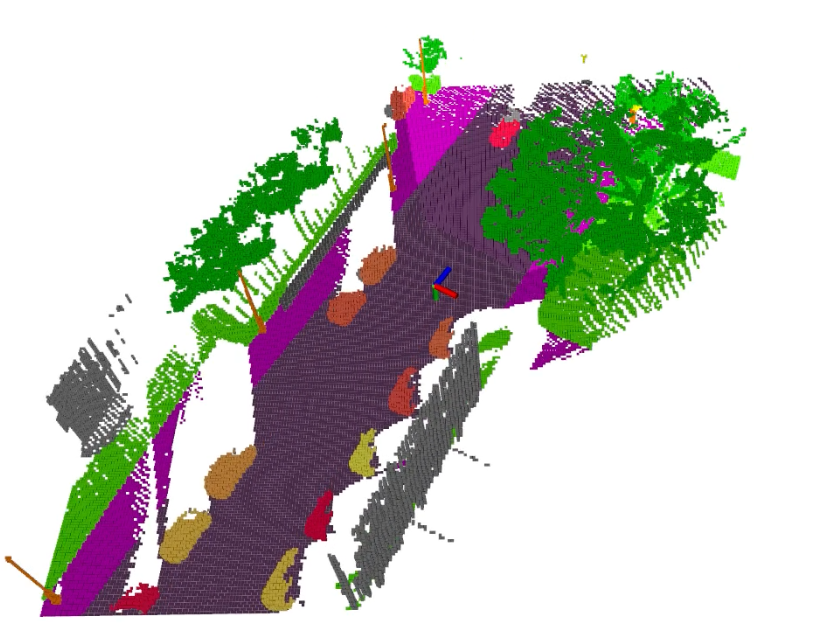

# Semantic DSP Map

## Description
This repository contains the code for paper "Particle-based Instance-aware Semantic Occupancy Mapping in Dynamic Environments". This paper is still under review. The currently released code version is an unoptimized version working for a simple example.
The C++ source file for mapping is in the ```include/``` folder and a ros node example that uses the map is given in ```src/mapping_with_external_data.cpp```
After acceptance of the paper this repository will contain the optimized and complete version.

The following images shows a simple mapping result using the Virtual Kitti 2 dataset.

<p align="center">

</p>


## Compile
Tested Environment: Ubuntu 20.04 + ROS Noetic

- Our code uses yaml-cpp. Follow instructions in [yaml-cpp](https://github.com/jbeder/yaml-cpp) to install it first.

- Then download and compile the mapping code by

```
mkdir -p semantic_map_ws/src
cd semantic_map_ws/src
git clone git@github.com:g-ch/mask_kpts_msgs.git
git clone --recursive git@github.com:tud-amr/semantic_dsp_map.git
cd ..
catkin build
```

## Test
Download a ros data [bag](https://drive.google.com/file/d/1MyLyJzOX_KFJWhs0cSW6jwEC2t_l945Q/view?usp=drive_link) containing depth image, rgb image, and camera pose from Virtual Kitti 2 dataset, and a message in mask_kpts_msgs form containing segmentation and transformation estimation results.

Launch the test by
```
roslaunch semantic_dsp_map test.launch
```

## Parameters
### Compile Parameter
Compile parameters are in ```include/settings/settings.h```. These parameters include the size of the circular buffer, camera intrisics, depth range etc. These parameters are related to the data structure. The code should be rebuild after changing these parameters.

### Yaml Parameter
Yaml parameters are loaded to the node when the node is started. The yaml file is at ```cfg/options.yaml```. These parameters are some options in the mapping. Check their names to know the meaning.


## Liciense
Apache-2.0
