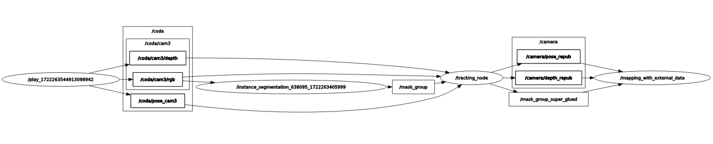

## Description
This file contains instructions of using Semantic DSP map with Superpoints-based tracking and transformation estimation. We tested this in the Virtual Kitti dataset and part of data in the UT Campus dataset. 


## Installation
1. Download the code and build
    ```
    mkdir -p semantic_map_ws/src
    cd semantic_map_ws/src
    git clone git@github.com:g-ch/mask_kpts_msgs.git
    git clone --recursive git@github.com:g-ch/Semantic_DSP_Map.git
    catkin build
    ```

2. Detection and tracking node
   
   We developed our Superpoints-based tracking and transformation estimation node in an independent repository, named [single_camera_tracking](https://github.com/g-ch/single_camera_tracking/tree/main). Please refer to the readme file of this repository to install dependencies and compille the code.


## Set Key Parameters
In ```include/settings/setting.h```, set ```#define SETTING 2``` and change the camera intrinsics and image size if you are using a dataset other than VIRTUAL_KITTI2.

```
#elif SETTING == 2 ///< VIRTUAL_KITTI2
    ...
    constexpr float g_camera_fx_set = 725.0087f; ///< Focal length in x direction. Unit: pixel
    constexpr float g_camera_fy_set = 725.0087f; ///< Focal length in y direction. Unit: pixel
    constexpr float g_camera_cx_set = 620.5f; ///< Principal point in x direction. Unit: pixel
    constexpr float g_camera_cy_set = 187.f; ///< Principal point in y direction. Unit: pixel

    constexpr int g_image_width_set = 1242; ///< Image width. Unit: pixel
    constexpr int g_image_height_set = 375; ///< Image height. Unit: pixel
```

After the above parameters are set, run ```catkin build```.

Then change the camera intrinsics in ```single_camera_tracking/cfg
/settings.yaml```. In the yaml file, ```scene_name``` and ```dataset_path``` are used to read semantic segmentation images.


Information about other optional parameters can be found in [Parameter Table](parameter_table.md).

## Usage
- Run segmentation node by
```
conda activate openmmlab
rosrun single_camera_tracking instance_segmentation.py
```
__Note__: The config and checkpoint file path should be replaced by your own.

- Run superpoint_superglue and tracking node by
```
conda activate openmmlab
rosrun single_camera_tracking tracking
``` 
__Note__: the first time you run this node you will see ```Building inference engine......```. It will take about 15 minutes to 1 hour to build. 


- Run mapping node by 
```
roslaunch semantic_dsp_map virtual_kitti2.launch
rosbag play clip1.bag
```

Then provide data to the following topics by reading data from your dataset.
```
sensor_msgs::Image  /camera_rgb_image
sensor_msgs::Image  /camera_depth_image
geometry_msgs::PoseStamped /camera_pose
```

The topic will be transmitted as the following graph shows

<p align="center">

</p>


## Real-time Performance

Mapping can be run in real time with a good CPU but instance & semantic segmentation, superpoints extraction and matching also take a relatively long time therefore overall real time performanace is hard to achieve. Mapping 10 HZ, overall less than 5Hz.